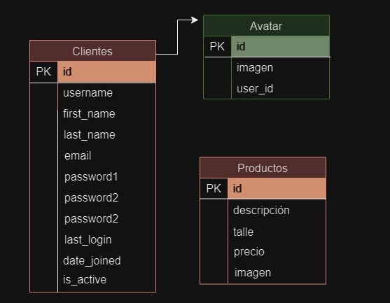

# CODERHOUSE - PYTHON - Proyecto Final- Arraras Milagros #

## PROYECTO: ONLINE CLOTHING STORE :shopping:

### INDICE ###

-Video
-Notas
-Enlace página
-Acceder al admin
-Acceder al cliente
-Autor
-Sobre el proyecto
-Código
-Extensiones

### VIDEO ###
https://www.loom.com/share/00dd387591344f24b6b362c10849d51a?sid=92bc5fd4-58b4-4d3c-8bc5-5f1896f9e3fb

### NOTAS ###
Utilizar la rama main

### ENLACE PÁGINA ###

(http://127.0.0.1:8000/admin/)

(http://127.0.0.1:8000/)

(http://127.0.0.1:8000/store/)

(http://127.0.0.1:8000/products/)

(http://127.0.0.1:8000/clientes/)

### ACCEDER AL ADMIN  :old_key:

**username**: milagros

**password**: 123456789

### USUARIO CLIENTES ###

**username**:zMilagros_a

**password**: Milagros123456789

### AUTOR ###

Milagros Arraras, aprendiz de Python.

### SOBRE EL PROYECTO ###

El proyecto consiste en una base de datos de un comercio donde tiene:

**TIENDA/HOME**

**-Clientes**

**-Categorías/Productos**

La **TIENDA/Home** es la página inicial que nos muestra el "Sobre nosotros de la página" donde se introduce sobre la Tienda y los productos que ofrece.

En **Clientes** permitimos al personal que se cree un usuario para poder administrar los productos de la tienda. Para ingresar debe rellenar un par de campos y respetar un par de requisitos, luego de registrarse podemos ingresar y editar el usuario. Este usuario permitirá visualizar los productos dentro de categorías.

En **Categorías** encontramos los tipos de prendas separadas por secciones como parte superior; remeras y tops; parte inferior; pantalones y faldas; segundapiel; abrigos. Debajo de esa introducción a los **Productos** disponibles, debemos ingresar a el botón Iniciar sesión para ver stock de productos y luego desde allí el personal podrá editarlos según haya stock de los mismos. Entre las opiones podrá Editar, Eliminar, Agregar y Ver Detalles de los productos.

La página está orientada en este caso a comercios femeninos, pero al ser pensada como una base para vender a tiendas de ropa en un futuro, fue creada para ser flexible en caso de reutilizar el proyecto para otro comercio. Pero con mis conocimientos logré crear una tienda donde el admin puede editar los productos en stock inciando sesión. 

### COMANDOS para ejecutar la página web: triangular_flag_on_post:

Para iniciar nuestro código hay que instalar **pip install django**
Luego, dentro de la carpeta project, ejecutar **python manage.py runserver**

### 🔗Dependencias Externas ###

**Visual Studio Code**

**Django**

**Bootstrap**

### DIAGRAMA ###

